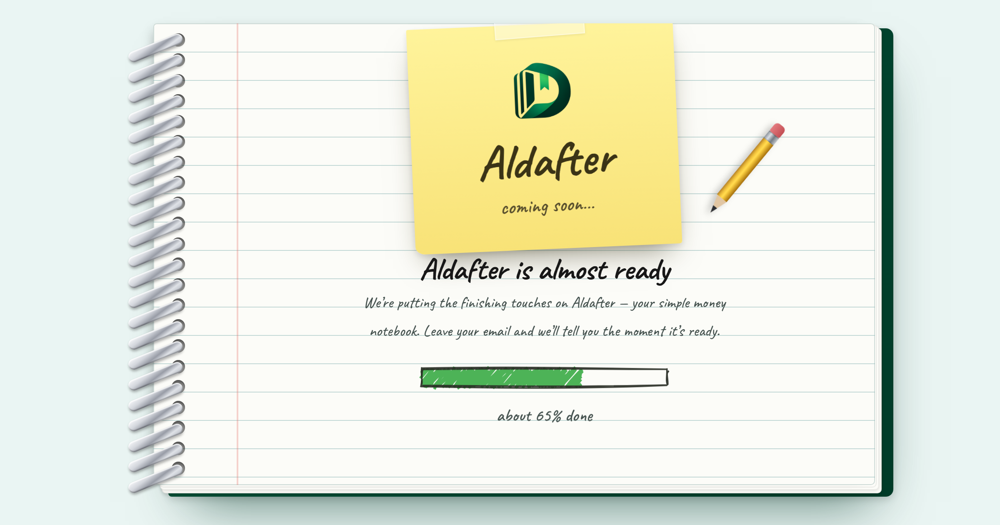

<h1 align="center">
  Abdullah Almofleh
  
</h1>

  <b>Senior Full-Stack Engineer</b> &nbsp;·&nbsp; NestJS / Next.js Specialist &nbsp;·&nbsp; Dubai, United Arab Emirates

  <i>Building high-scale, real-time systems.</i>

  
  
  
  

---

<!--
  The image sits beside the text on wide screens and drops to its own row on
  narrow ones. GitHub strips CSS, so the two slots below swap places using the
  media queries <picture> does support: whichever one does not apply collapses
  to a 1x1 transparent spacer instead of rendering the image at a smaller size.
-->

<a href="https://almofleh.dev" target="_blank"><picture><source media="(min-width: 1001px)" srcset=".github/assets/spacer.png" /></picture></a>

<a href="https://almofleh.dev" target="_blank"><picture><source media="(max-width: 1000px)" srcset=".github/assets/spacer.png" /></picture></a>

<!-- SUMMARY:START -->
Senior Full-Stack Engineer with ~7 years building high-volume platforms at Estia Software DMCC (real time energy/e-learning), handling 2M+ daily time-series data points. Architected NestJS/PostgreSQL backends and Next.js/Typescript front-ends from scratch, driving 25-40% performance gains through database sharding and caching optimizations while mentoring development teams.
<!-- SUMMARY:END -->

- Currently **Senior Software Engineer at Estia Software DMCC**, leading architecture for energy SaaS platforms.
- Most at home where **real-time data meets scale**: sensor ingestion, time-series aggregation, and dashboards that stay fast under load.
- Work across the full lifecycle — architecture and API design through to deployment and production support.
- Learning **React Native** and **Unity** on the side.

 

## Currently building

**[Aldafter](https://aldafter.com)** — a simple money notebook. Accounts, debts, budgets and
reports in one organised place, wrapped in a paper notebook rather than a spreadsheet.
Next.js and NestJS, static export on the front, launching soon.

The banner above is not a mockup of the site. It is rendered from the site's own
components — the same notebook, sticky note and rough.js strokes — and regenerated
straight into its Open Graph image.

## Where I do my best work

Most of my recent engineering has been on systems that never stop receiving data. Sensors publish over **MQTT** through **AWS IoT Core**, land in **TimescaleDB** and **PostgreSQL**, and have to come back out as charts an energy professional can actually read — without waiting.

|             |                                                              |
| ----------- | ------------------------------------------------------------ |
| **2M+**     | time-series data points ingested daily                        |
| **40%**     | faster dashboard and chart load times                         |
| **50%**     | fewer production incidents after CI/CD and monitoring rollout |
| **95%**     | test coverage across Jest and Cypress suites                  |
| **99.9%**   | uptime SLA held on production platforms                       |
| **5+**      | engineers mentored, roughly doubling team velocity            |

## Selected work

<!-- PROJECTS:START -->
| Project | What it is | Built with |
| --- | --- | --- |
| **[Envita](https://envita.io/)** | Energy Monitoring Platform | Next.js/NestJS · MQTT/AWS IoT Core · TimescaleDB/PostgreSQL |
| **[Ecorize](https://ecorize.de/en)** | Energy Planning Software | React/GraphQL · PostgreSQL/Redis · NestJS |
| **[ASP School](https://asp-school.nl)** | Online Learning Platform | Laravel/React · Node.js |
| **Beethere** | Taxi Ordering Application | Laravel · WebSockets/Socket.io · Node.js · Next.js |
| **Al-Adham** | E-Commerce Platform | Laravel · Stripe |
| **Bact** | Consulting & Training (E-Learning) | Node.js/TypeORM/PostgreSQL |
| **Events Management System** | — | Node.js/MongoDB · REST APIs |
<!-- PROJECTS:END -->

## Stack

<!-- STACK:START -->
| Area | Tools |
| --- | --- |
| **Languages** |    |
| **Front-End** |     |
| **Back-End** |      |
| **Databases** |      |
| **Real-time & IoT** |    |
| **APIs** |   |
| **DevOps and Cloud** |     |
| **Testing/Tools** |     |
| **Methodologies** |   |
<!-- STACK:END -->

<b>Career so far</b>

 

<!-- EXPERIENCE:START -->
| Period | Role | Company |
| --- | --- | --- |
| May 2023 — Present | Senior Software Engineer | Estia Software DMCC · Dubai, United Arab Emirates |
| December 2022 — May 2023 | Software Engineer | Nordelco DMCC · Dubai, United Arab Emirates |
| October 2022 — December 2022 | Software Engineer | Digital Real Marketing · Dubai, United Arab Emirates |
| November 2021 — September 2022 | Full-Stack Developer | 3 Miles · Damascus, Syria |
| August 2020 — March 2022 | Full-Stack Developer | Unifi Solutions · Remote, Part-time |
| February 2021 — May 2021 | Full-Stack Developer | Technical G · Damascus, Syria |
| July 2020 — October 2021 | Full-Stack Developer | Aspiraties · Damascus, Syria (Remote, Part-time) |
| May 2019 — April 2021 | Full-Stack Developer | We Media · Damascus, Syria |

**Education** — Bachelor of Information Engineering (Artificial Intelligence), Arab International University, Damascus, Syria. October 2016 - February 2022, GPA 3.25 out of 4.00.
<!-- EXPERIENCE:END -->

## Get in touch

Open to collaborating on **React and Next.js work**, **AI projects**, and generally anything new and interesting. Email is the fastest way to reach me.

|                  |                                                                              |
| ---------------- | ---------------------------------------------------------------------------- |
| **Email**        | [almofleh.abdullah@gmail.com](mailto:almofleh.abdullah@gmail.com)              |
| **LinkedIn**     | [in/abdullah-almofleh](https://www.linkedin.com/in/abdullah-almofleh)          |
| **Portfolio**    | [almofleh.dev](https://almofleh.dev)                                           |
| **Discord**      | [@\_aborii](https://discord.com/users/_aborii)                                 |
| **Based in**     | Dubai, United Arab Emirates — Gulf Standard Time, UTC+4                        |
| **Languages**    | <!-- LANGUAGES:START -->Arabic (native), English (professional)<!-- LANGUAGES:END --> |

## Activity

<picture>
  <source media="(prefers-color-scheme: dark)" srcset="https://raw.githubusercontent.com/Aborii/Aborii/snake-svg/github-contribution-grid-snake-dark.svg">
  <source media="(prefers-color-scheme: light)" srcset="https://raw.githubusercontent.com/Aborii/Aborii/snake-svg/github-contribution-grid-snake.svg">
  
</picture>
